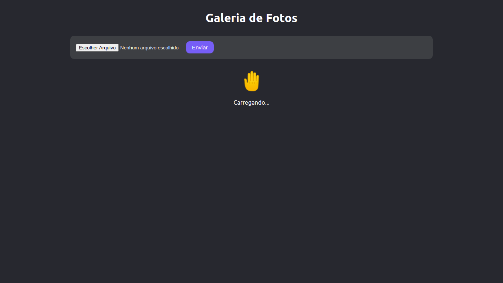
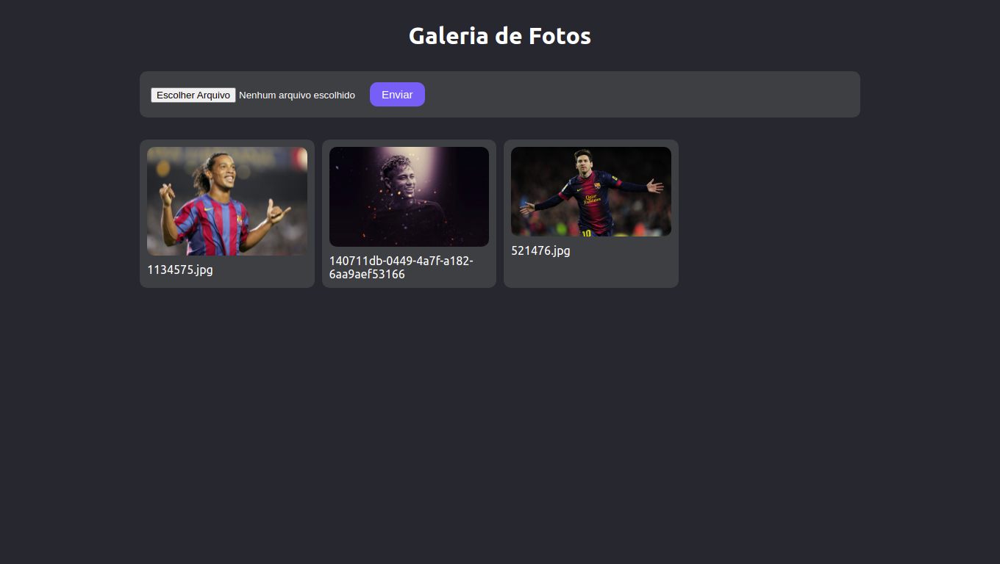
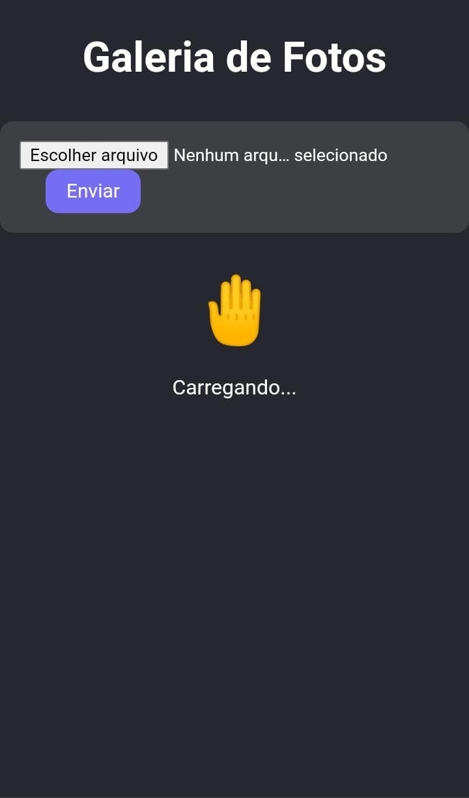
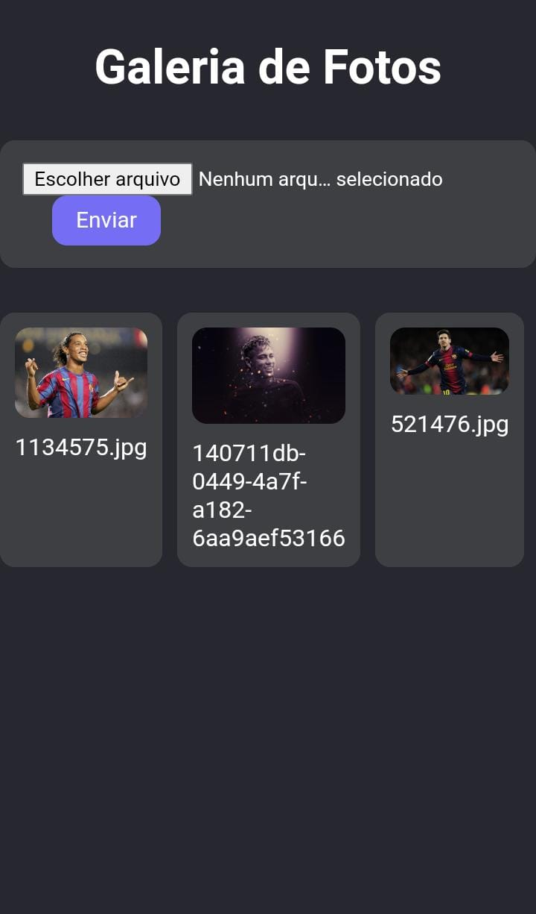

# Galeria de fotos

### Teste o projeto acessando o site
https://edgomes-dev.github.io/gallery-react

# Layout Desktop

  
  

# Layout Mobile

  
  

# Sobre este  projeto
A ideia do App é:

"Uma galeria de fotos online, armazenando as imagens na nuvem".

# Algumas informações sobre este Website

1 - Este projeto, utiliza o firebase para armazena as imagens.

# Funcionalidades

* Você pode selecionar uma imagem, e envar ela para o servidor.
* Não precisa atualizar a página, ele mesmo faz o refresh sozinho.
* Ele possui um validador de arquivo, aceitando apenas imagens.

# Construido com:
* Firebase - Utilizado para armazenar as imagens.
* Typescript - Foi utilizado por ser uma versão tipada do javascript, o que ajuda na hora de receber dados, evitando receber dados invalidos. Além de ser melhor na hora de realizar manutenção e na construção do sistema é bem mais prático e evita erros.
* React - Utilizada para fazer a construção do front-end, reaproveitando código com components e ser mais perfórmatico com renderização SPA.
* Styled-components - Utilizado para estilizar, aplicando os estilos css. 
* Context-React - Utilizado para gerenciar o estado da aplicação.
* uuid - Utilizado para gerar um hash aleatório e colocar com o nome da imagem, para que não gere erros.
* gh-pages - Utilizado para colocar o site no ar com o github pages, criando uma build e subindo para o servidor com apenas um comando.
